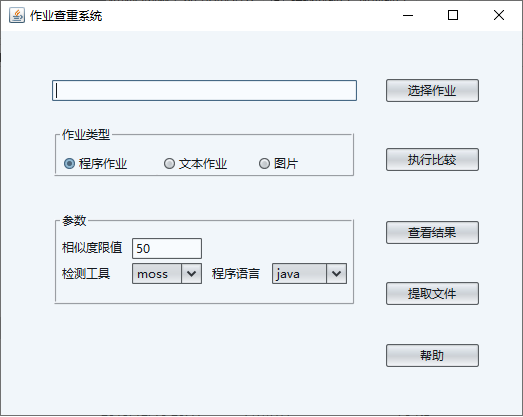

# antiplag 程序代码及文档作业相似度检查软件
软件主要检查、比较学生提交的电子档文本相似度，能对程序语言（如java、c/c++、python等）、中英文文档（如实验报告等）之间的文本相似度进行比较分析，输出相似度高的文档，进而辅助发现学生之间互相抄袭的行为。

## 需求
[jdk11](https://www.oracle.com/technetwork/java/javase/downloads/jdk11-downloads-5066655.html)

## 安装
直接下载或clone项目源代码版，或下载软件的发布版[releases](https://github.com/fanghon/antiplag/releases)。
源代码版可以直接导入eclipse，主入口类是gui.plag.edu下的PlagGUI。
系统在window10，jdk11 64位下开发、运行。

## 使用
在发布版子目录下，双击run.bat批处理程序，就能启动程序。使用说明参见发布版子目录下的软件使用文档。程序主界面如下：
 
  
## 原理
系统采用的主要技术是自然语言处理（nlp）中的文本相似度计算。程序类文本的相似度比较基于3个开放系统：
* 一是基于网络服务的[MOSS系统](http://theory.stanford.edu/~aiken/moss/)（斯坦福大学开放的支持多种编程语言代码相似度比较的系统）;
* 二是本地执行的[sim系统](https://dickgrune.com/Programs/similarity_tester/)（支持java、c等语言的文本相似度比较）。
* 三是本地执行的[jplag系统](https://github.com/jplag/jplag/)（支持java、c/c++、python等语言的文本相似度比较）。

本系统在它们基础上进行了二次开发和封装，针对moss系统，开发出了客户端存取模块，实现了代码文件提交、结果获取和解析、结果排序等功能；针对sim和jplag，则将其集成到系统中，在moss因网络故障等原因不可用时，可作为替代产品使用。

中英文文档作业相似度的比较则基于[shinglecloud算法](https://www.kom.tu-darmstadt.de/de/research-results/0/1/shinglecloud/)（一种基于文本指纹的、语言无关的相似度快速计算方法），文档主要处理过程如下：
1. 使用tika读取不同格式（txt、doc、docx等）的文档，并将其转换成能统一处理的文本；
2. 使用ikanalyzer对文本进行预处理、精确分词；
3. 使用shinglecloud算法计算文本之间的相似度；
4. 根据相似度排序，输出比较结果。

## TODO
1. 将jplag整合进系统。已实现。
2. 支持存储以往作业文档，支持基于数据库的作业查重。
2. 开发web版作业查重软件。

源于开源，还于开源，开源是美德，加星也是美德 :smile: 。

 